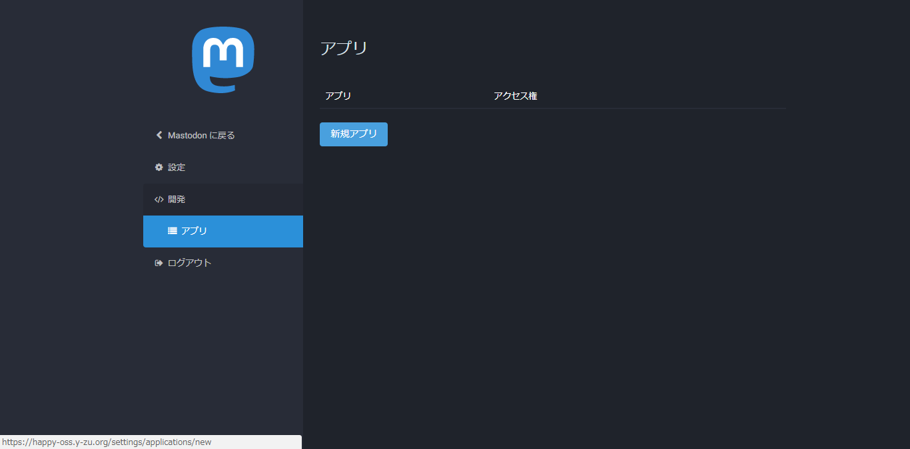
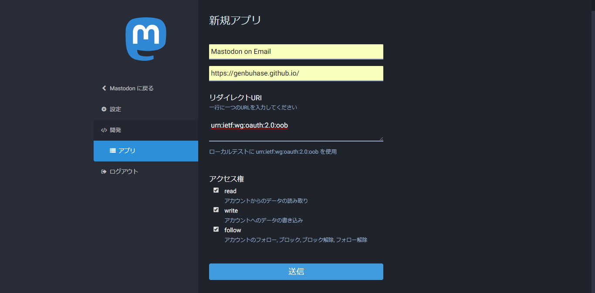
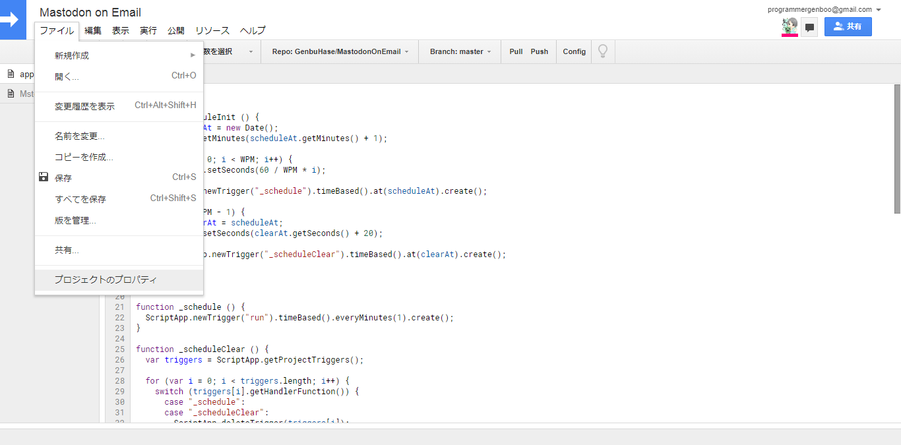
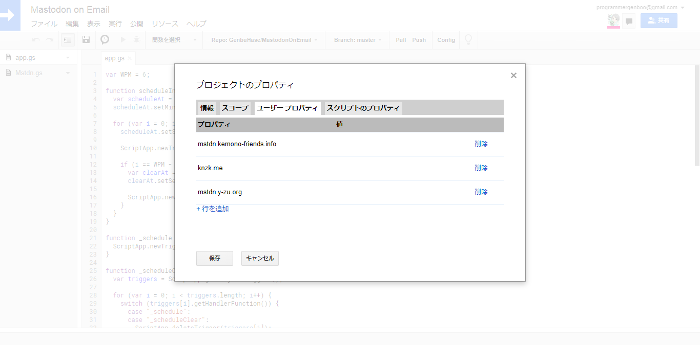

# Mastodon on Email(MoE)
A tool for enjoying Mastodon on Email

## Languages
* [Japanese | 日本語](/README[Japanese].md)

## Description
MoE helps you toot with only e-mail. 
It is quite useful for users who don't have any smartphones.

## Requirement
* [Google Apps Script](https://www.google.com/script/start)
* [clasp](https://github.com/google/clasp)

## Usage
Please follow the instructions.
1.	Copy all files to your GAS project
2.	Prepare any tokens to handle your account(See [Token Settings](#token-settings))
3.	Launch `launch()`
4.	Make me busy by sending a lot of e-mails!(See [Subject Format](#subject-format) & [Magics](#magics))

## Token Settings
1.	Open "Applications" in settings(`https://{:instance}/settings/applications`) 
	

2.	Generate a token with these settings 
	... Application's name: `Mastodon on Email` 
	... Application's website: `https://genbuhase.github.io/` 
	... Application's permissions: `read, write, follow` 
	

3.	Open "Project Properties" from "File" tab 
	

4.	Write both the instance and the token to fields in "User Properties" tab 
	

## Subject Format
A base format of MoE is `MoE{:feature?}<{:args?}>@{:instance}`.
> `{:feature?}` ... A name of feature 
> `{:instance}` ... An instance you've connected with MoE 
> `{:args?}` ... Arguments of each features

These are examples of format-list.
> `MoE:Toot` ... Equals to `MoE:Toot@{:instance}` 
> `<1>` ... Equals to `MoE<1>@{:instance}` 
> `MoE:Toot<1>` ... Equals to `MoE:Toot<1>@{:instance}`

| Format of subject | Description |
|:----------|:----------|
| Base Format | Post contents in body |
| <`{:privacy}`> | Post with selected privacy |
|| `0` ... Public |
|| `1` ... Unlisted |
|| `2` ... Private |
|| `3` ... Direct Message |
|| `Others(public \| unlisted \| ...)` ... Provided privacy |
| MoE:Toot | Equal to `Base Format` |
| MoE:Toot<`{:privacy}`> | Equal to `<{:privacy}>` |
| MoE:Notify | Send notifications to your address |

## Magics
You can put down them in body.

| Format of magic | Description |
|:----------|:----------|
| [CW \| `{:CWContent}`] | Post with warning |
| [`{:emojiCode}` \| `{:quantity}`] | Replaces with `quantity` pieces of an emoji defined as `emojiCode` |

## Author
* Mastodon
  * [ProgrammerGenboo@itabashi.0j0.jp](https://itabashi.0j0.jp/@ProgrammerGenboo)
  * [ProgrammerGenboo@knzk.me](https://knzk.me/@ProgrammerGenboo)
* [Genbu Hase(Github)](https://github.com/GenbuHase)

## License
[MIT License](/LICENSE)