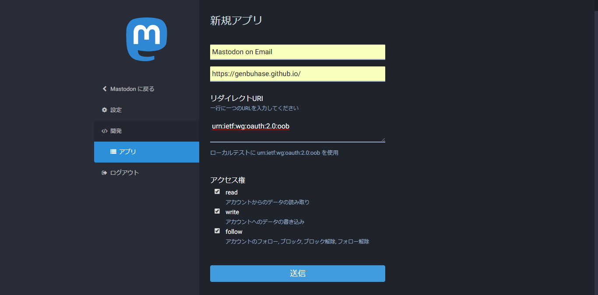
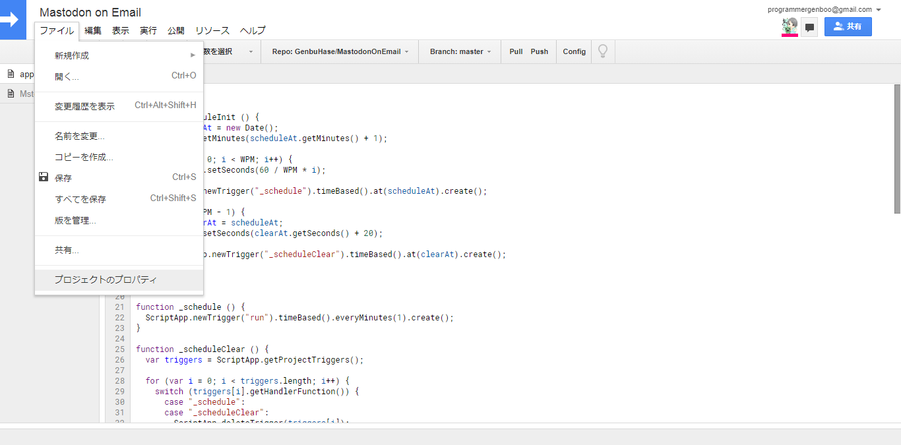
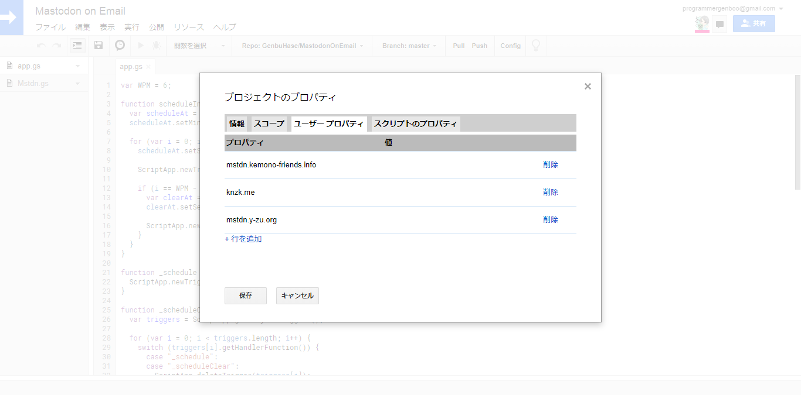

# Mastodon on Email(MoE)
A tool for enjoying Mastodon on Email

## Languages
* [Japanese | 日本語](/README_ja.md)

## Description
MoE helps you toot with only e-mail. 
It is espicially useful for users who don't have any smartphones.

## Features
* Adds instances to use
* Adjusts status privacy
* Uses some features such as CW in body
* Handles your account

## Requirement
* [Google Apps Script](https://www.google.com/script/start/)

## Usage
Please follow the instructions if you want to use.
1.	Copy all files to your GAS project
2.	Prepare any tokens to handle(See [Token Settings](#token-settings))
3.	Launch `scheduleInit()`
4.	Make me busy by sending e-mails!(See [Format List](#format-list) & [Magic List](#magic-list))

## Token Settings
1.	Open "Applications" in settings(`https://{:instance}/settings/applications`) 
	

2.	Generate a token with these settings 
	... Application's name: `Mastodon on Email` 
	... Application's website: `https://genbuhase.github.io/` 
	... Application's permissions: `read, write, follow` 
	

3.	Open "Project Properties" from "File" tab 
	

4.	Write both the instance and the token to fields in "User Properties" tab 
	

## Format List
A base format of MoE is `MoE@{:instance}`.
> `{:instance}` ... An instance you've connected with MoE

These are examples of format-list.
> `MoE:Toot` ... Equals to `MoE:Toot@{:instance}`
> 
> `<1>` ... Equals to `MoE@{:instance}<1>`
> 
> `MoE:Toot<1>` ... Equals to `MoE:Toot@{:instance}<1>`

| Format of subject | Description |
|:----------|:----------|
| Base Format | Toots a body of the mail |
| <`{:privacy}`> | Toots with selected privacy |
|| `0` ... Public |
|| `1` ... Unlisted |
|| `2` ... Private |
|| `3` ... Direct Message |
|| `Others(public \| unlisted \| ...)` ... Provided privacy |
| MoE:Toot | Equals to `Base Format` |
| MoE:Toot<`{:privacy}`> | Equals to `<{:privacy}>` |
| MoE:Notify | Requests to MoE to send notifications, which are only mentions |

## Magic List
| Format of magic | Description |
|:----------|:----------|
| [CW \| `{:CWContent}`] | Toots with warning by the text |

## Author
* Mastodon
  * [ProgrammerGenboo@itabashi.0j0.jp](https://itabashi.0j0.jp/@ProgrammerGenboo)
  * [ProgrammerGenboo@knzk.me](https://knzk.me/@ProgrammerGenboo)
* [Genbu Hase(Github)](https://github.com/GenbuHase)

## License
[MIT License](/LICENSE)