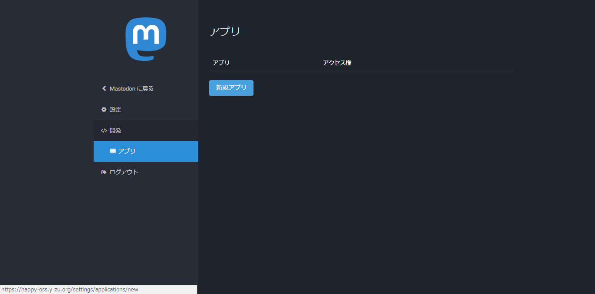

# Mastodon on Email(MoE)
Eメールで楽しむMastodonライフ

## 言語
* [英語 | English](/README.md)

## 概要
MoEを使えば、Eメールだけでトゥートが出来るようになります。 
特にガラケーをお使いの方々に強くお勧めいたします。(作者が一番愛用してますｗ)

## 動作環境
* [Google Apps Script](https://www.google.com/script/start)
* [clasp](https://github.com/google/clasp)

## 使用方法
お使いになる際には、以下の手順に従って設定してください。
1.	GASプロジェクトに全ファイルをコピーする
2.	トークンの設定をする(→ [トークン設定](#トークン設定))
3.	`launch()`を実行
4.	数分で起動完了です！(→ [件名フォーマット](#件名フォーマット) & [特殊機能](#特殊機能))

## トークン設定
1.	設定の[開発]内にある[アプリ]を開く(`https://{:instance}/settings/applications`) 
	

2.	以下の設定でトークンを生成する 
	... アプリの名前: `Mastodon on Email` 
	... アプリのウェブサイト: `https://genbuhase.github.io/` 
	... アクセス権: `read, write, follow` 
	

3.	[ファイル]タブ内の[プロジェクトのプロパティ]を開く 
	

4.	[ユーザープロパティ]タブにインスタンス及びトークン情報を追記 
	

## 件名フォーマット
フォーマットベースは`MoE{:feature?}<{:args?}>@{:instance}`です。
> `{:feature?}` ... 機能名 
> `{:instance}` ... アカウントのインスタンス 
> `{:args?}` ... 各機能の引数

フォーマットの例は以下の通りです。
> `MoE:Toot` ... `MoE:Toot@{:instance}`を示す 
> `<1>` ... `MoE<1>@{:instance}`を示す 
> `MoE:Toot<1>` ... `MoE:Toot<1>@{:instance}`を示す

| 件名のフォーマット | 概要 |
|:----------|:----------|
| フォーマットベース | 本文の内容でトゥート |
| <`{:privacy}`> | 指定された公開範囲でトゥート |
|| `0` ... 公開 |
|| `1` ... 未収載 |
|| `2` ... 非公開 |
|| `3` ... ダイレクト |
|| `その他(public \| unlisted \| ...)` ... 指定された公開範囲 |
| MoE:Toot | `フォーマットベース`と同機能 |
| MoE:Toot<`{:privacy}`> | `<{:privacy}>`と同機能 |
| MoE:Notify | 通知情報をメールアドレスに送信 |

## 特殊機能
| 特殊機能のフォーマット | 概要 |
|:----------|:----------|
| [CW \| `{:CWContent}`] | CWを付けてトゥート |
| [`{:emojiCode}` \| `{:quantity}`] | `emojiCode`の絵文字を`quantity`個並べて置換 |

## 作者
* Mastodon
  * [ProgrammerGenboo@itabashi.0j0.jp](https://itabashi.0j0.jp/@ProgrammerGenboo)
  * [ProgrammerGenboo@knzk.me](https://knzk.me/@ProgrammerGenboo)
* [Genbu Hase(Github)](https://github.com/GenbuHase)

## ライセンス
[MIT License](/LICENSE)