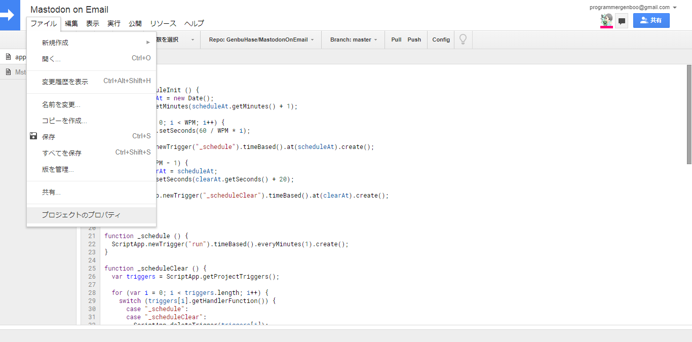

# Mastodon on Email(MoE)
Eメールで楽しむMastodonライフ

## 概要
MoEを使えば、Eメールだけでトゥートが出来るようになります。 
特にガラケーをお使いの方々にお勧めです。

## MoEの特徴
* 自由にインスタンスが追加可能
* トゥート公開範囲が変更可能
* CW等の機能も充実
* その他諸々...

## 動作環境
* [Google Apps Script](https://www.google.com/script/start/)

## 使用方法
お使いになる際には、以下の通りに従ってください。
1.	GASプロジェクトに全ファイルをコピーする
2.	トークンの設定をする([トークン設定](#トークン設定)をご参照下さい)
3.	`scheduleInit()`を実行
4.	起動完了です！！お楽しみ下さい！([フォーマット表](#フォーマット表) & [魔導書](#魔導書)をご参照下さい)

## トークン設定
1.	設定の[開発]内にある[アプリ]を開く(`https://{:instanceUrl}/settings/applications`) 
	

2.	以下の設定でトークンを生成する 
	... アプリの名前: `Mastodon on Email` 
	... アプリのウェブサイト: `https://genbuhase.github.io/` 
	... アクセス権: `read, write, follow` 
	

3.	[ファイル]タブ内の[プロジェクトのプロパティ]を開く 
	

4.	[ユーザープロパティ]タブにインスタンス及びトークン情報を追記 
	

## フォーマット表
フォーマットベースは`MoE@{:instanceUrl}`です。
> `instanceUrl` ... トゥートするアカウントのインスタンス

フォーマットの例は以下の通りです。
> `MoE:Toot` ... `MoE:Toot@{:instanceUrl}`を示す
> 
> `<1>` ... `MoE@{:instanceUrl}<1>`を示す
> 
> `MoE:Toot<1>` ... `MoE:Toot@{:instanceUrl}<1>`を示す

| 件名のフォーマット | 概要 |
|:----------|:----------|
| フォーマットベース | 本文の内容でトゥートします |
| <`{:privacy}`> | 指定された公開範囲でトゥートします |
|| `0` ... 公開 |
|| `1` ... 未収載 |
|| `2` ... 非公開 |
|| `3` ... ダイレクト |
| MoE:Toot | `フォーマットベース`と同機能 |
| MoE:Toot<`{:privacy}`> | `<{:privacy}>`と同機能 |
| MoE:Notify | メンション通知の情報をリクエストします |

## 魔導書
| 魔導のフォーマット | 概要 |
|:----------|:----------|
| [CW \| `{:CWContent}`] | CWを付けてトゥートします |

## 作者
[Genbu Hase](https://github.com/GenbuHase)

## ライセンス
[MIT License](https://github.com/GenbuHase/MastodonOnEmail/blob/master/LICENSE)

## Other Languages
* [英語 | English](https://github.com/GenbuHase/MastodonOnEmail/blob/master/README.md)